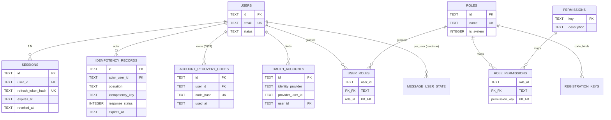
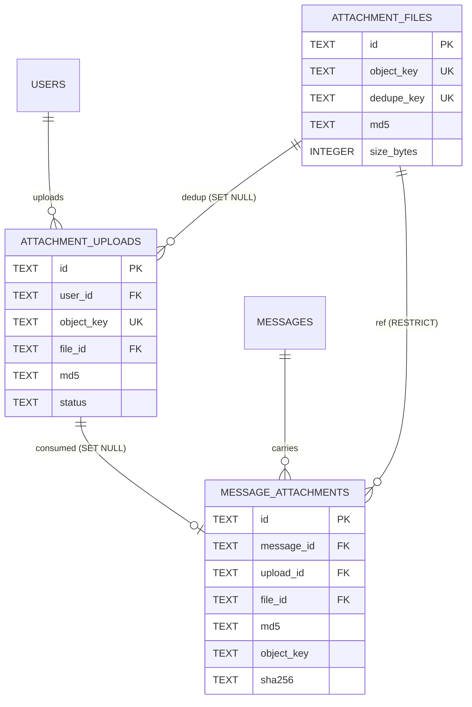
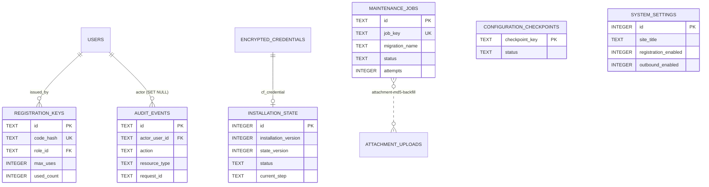

# Cloud Mail — Database ERD

> Source: `migrations/0001_initial.sql` … `migrations/0011_mvp_minimum.sql`
> (applied in M1 as of 2026-08-09; see `docs/architecture/mvp-blueprint.md`
> for the dormant columns / triggers kept by `0011_mvp_minimum.sql`).
>
> Each table only lists **PK / FK / key business fields**; full column listings live in the migration files.

## 1. Identity & RBAC



## 2. Provider / Domain / Mailbox

```mermaid
erDiagram
    ENCRYPTED_CREDENTIALS ||--o{ PROVIDER_CONNECTIONS : "1:N"
    PROVIDER_CONNECTIONS ||--o{ DOMAINS              : "outbound_for (opt)"
    DOMAINS ||--|| DOMAIN_SIGNATURES                  : "1:1"
    DOMAINS ||--o{ MAILBOXES                         : "hosts"
    USERS ||--o{ MAILBOXES                           : "owns"
    MAILBOXES ||--o{ MAILBOX_MEMBERS                 : "shares"

    ENCRYPTED_CREDENTIALS {
      TEXT id PK
      INTEGER encryption_version
    }
    PROVIDER_CONNECTIONS {
      TEXT id PK
      TEXT provider_key
      TEXT label
      TEXT credential_id FK
      TEXT status
    }
    DOMAINS {
      TEXT id PK
      TEXT name UK
      TEXT status
      TEXT outbound_connection_id FK
    }
    DOMAIN_SIGNATURES {
      TEXT id PK
      TEXT domain_id FK_UK
      INTEGER is_enabled
    }
    MAILBOXES {
      TEXT id PK
      TEXT domain_id FK
      TEXT owner_user_id FK
      TEXT address UK
      TEXT status
    }
    MAILBOX_MEMBERS {
      TEXT mailbox_id PK_FK
      TEXT user_id PK_FK
      TEXT role
    }
```

## 3. Messages & Outbound Jobs

```mermaid
erDiagram
    DOMAINS ||--o{ MESSAGES                    : "scopes (0005)"
    PROVIDER_CONNECTIONS ||--o{ MESSAGES       : "sends/receives"
    USERS ||--o{ MESSAGES                      : "authored_by"
    MESSAGES ||--|| OUTBOUND_JOBS              : "1:1 dispatch"
    MESSAGES ||--o{ MESSAGE_RECIPIENTS         : "to/cc/bcc"
    MAILBOXES ||--o{ MAILBOX_MESSAGES          : "filed_into"
    MESSAGES ||--o{ MAILBOX_MESSAGES           : "delivered_to"
    MAILBOX_MESSAGES ||--o{ MESSAGE_USER_STATE : "per_user"
    USERS ||--o{ MESSAGE_USER_STATE            : "per_user"

    MESSAGES {
      TEXT id PK
      TEXT thread_id
      TEXT domain_id FK
      TEXT from_address
      TEXT status
      TEXT provider_connection_id FK
      TEXT provider_message_id
      TEXT created_by_user_id FK
    }
    OUTBOUND_JOBS {
      TEXT id PK
      TEXT message_id FK_UK
      TEXT status
      INTEGER attempts
      INTEGER created_via_schedule
    }
    MESSAGE_RECIPIENTS {
      TEXT id PK
      TEXT message_id FK
      TEXT type
      TEXT address
    }
    MAILBOX_MESSAGES {
      TEXT id PK
      TEXT mailbox_id FK
      TEXT message_id FK
      TEXT folder
    }
    MESSAGE_USER_STATE {
      TEXT mailbox_message_id PK_FK
      TEXT user_id PK_FK
      INTEGER is_read
      INTEGER is_starred
      TEXT deleted_at
    }
```

## 4. Attachments (refactored in `0007`)



> Triggers on `message_attachments`: `validate_attachment_upload` (BEFORE INSERT — checks
> `file_id`/`object_key`/`size_bytes`/`status`/`expires_at`/`owner` against `attachment_uploads`) and
> `consume_attachment_upload` (AFTER INSERT — flips `attachment_uploads.status='consumed'`).

## 5. Provider Sync (Webhook Ingest)

```mermaid
erDiagram
    PROVIDER_CONNECTIONS ||--o{ PROVIDER_MESSAGE_STATE : "tracks"
    MESSAGES ||--o{ PROVIDER_MESSAGE_STATE            : "tracks (SET NULL)"
    PROVIDER_CONNECTIONS ||--o{ WEBHOOK_DELIVERIES     : "ingest"
    PROVIDER_CONNECTIONS ||--o{ WEBHOOK_EVENTS         : "audit"
    MESSAGES ||--o{ WEBHOOK_EVENTS                    : "audit-linked"

    PROVIDER_MESSAGE_STATE {
      TEXT provider_connection_id PK_FK
      TEXT provider_message_id PK
      TEXT domain_id FK
      TEXT message_id FK
      INTEGER status_event_time
      INTEGER status_rank
      TEXT import_lock_token
    }
    WEBHOOK_DELIVERIES {
      TEXT provider_connection_id PK_FK
      TEXT event_key PK
      TEXT domain_id FK
      TEXT processing_status
      TEXT lock_token
    }
    WEBHOOK_EVENTS {
      TEXT id PK
      TEXT provider_connection_id FK
      TEXT domain_id FK
      TEXT message_id FK
      TEXT event_type
      TEXT payload_json
    }
```

## 6. Operations / Bootstrap / Audit



## 7. Migration Topology

```
0001  base schema (users, roles, permissions, providers, domains, mailboxes,
       messages, outbound_jobs, mailbox_messages, message_user_state,
       attachment_uploads, message_attachments + 2 triggers,
       webhooks, audit_events, installation_state, system_settings)
 └── 0002  seed 20 permissions + admin/member roles
0001 → 0003  account_recovery_codes
0001 → 0004  configuration_checkpoints + bump installation_version→2
0001 → 0005  add domain_id to messages / provider_message_state /
             webhook_deliveries / webhook_events + backfill + 4 indexes
0002 → 0006  message.read_all (admin only)
0001 → 0007  attachment_files + file_id/md5 on uploads & message_attachments
             + rewritten validate trigger + legacy backfill + backfill job
0002 → 0008  attachment.read (admin + member)
0001 → 0009  outbound_jobs.created_via_schedule
```
